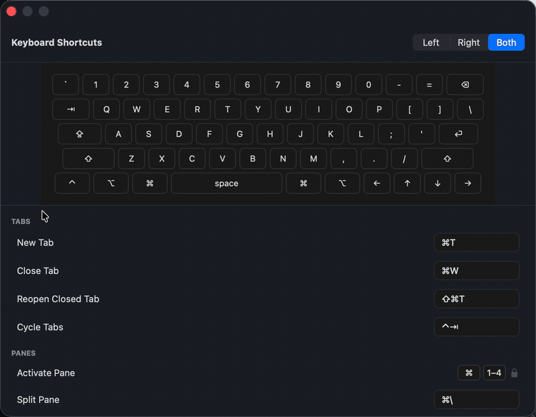
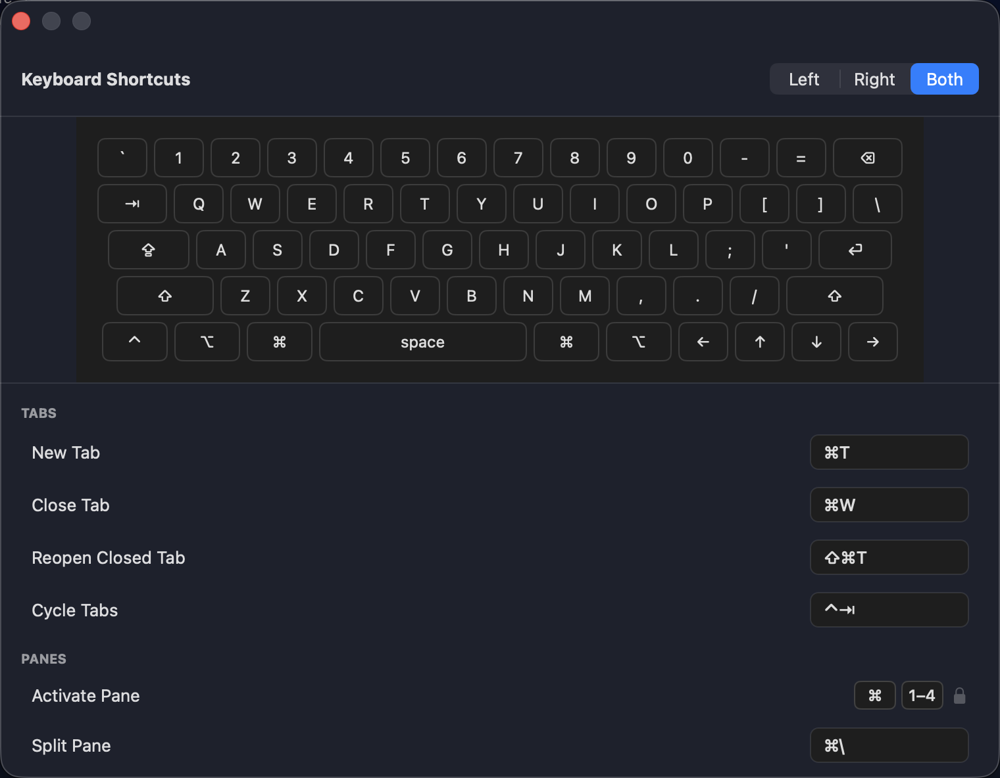
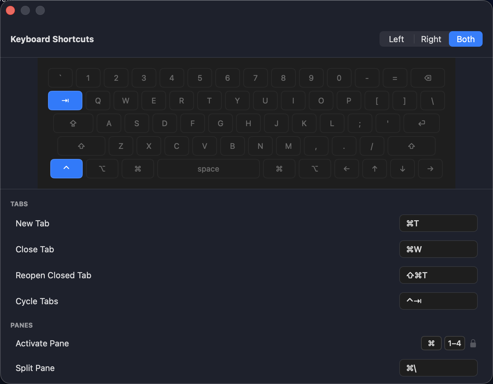

# ShortcutHelpKit

[](https://github.com/hcooch2ch3/ShortcutHelpKit/actions/workflows/ci.yml)

A keyboard-shortcut help window for macOS apps: a keyboard illustration, a grouped list
of shortcuts, and an optional rebinding field.





Hovering a row lights the keys that trigger it, and hovering a key lights every row that
uses it. Modifier caps are the exception: hovering `⌘` on its own would light every row
that carries it, which says something about the modifier rather than about any one key, so
it lights none of them. Here the pointer rests on one row and the illustration lights
the two keys that row is bound to:



The badge covers a plain SwiftPM build and test run on a macOS runner. It does not
reproduce an Xcode or generated-project layout, so a green badge is not a claim about
those.

The package renders. It does not know what a shortcut *is* in your app, where your
bindings live, or, with one exception noted under [Known gaps](#known-gaps), what
language your user reads. You supply all three.

⚠️ **The illustration is a US-ANSI keyboard and nothing else.** It is not generated from
the user's active input source; it is a fixed grid of US-QWERTY keycaps. On any other
physical layout the drawing is wrong about where the keys are, and on a non-US software
layout the letters do not correspond to what the user types. There is no injection point
for a different layout. If your users are not overwhelmingly on US-ANSI hardware, this
package is the wrong choice. Decide that before reading further, not after integrating.

## Used by

[MultiAIBrowser](https://apps.apple.com/app/id6757524860?mt=12) is a macOS menu bar app that
queries several AI chatbots side by side. Its shortcut window, keyboard illustration and
rebinding field are this package.

## Installation

```
.package(url: "https://github.com/hcooch2ch3/ShortcutHelpKit.git", .upToNextMinor(from: "0.2.0"))
```

```
.product(name: "ShortcutHelpKit", package: "ShortcutHelpKit")
```

`.upToNextMinor`, not `.upToNextMajor`. This is pre-1.0, so the minor slot is where breaking
changes land, and the wire format under [Storage](#storage) is explicitly not frozen.


## Hello world

Every Swift-tagged code block in this file is checked line by line against the package's
own sources and this test bundle, by `ReadmeFidelityTests`. The *integration example*
specifically, meaning the three blocks below plus the diagnostics block under
[Checking your integration](#checking-your-integration), lives in
`Tests/ShortcutHelpKitTests/ReadmeExample.swift`, which compiles against the public API
with no `@testable`. One other Swift-tagged block, the `KeyProjector` typealias, is quoted
straight from `ShortcutProjection.swift`.

The untagged blocks are the ones that cannot live in this package's sources: a consumer's
package manifest and a host's `windowWillClose`. Read those as illustrations. The JSON
under [Storage](#storage) is untagged too, and nothing reads it from here:
`ShortcutBindingWireFormatTests` pins the encoder's output against its own literals, which
is a different thing from checking this file.

Build a catalog of rows:

```swift
  static func makeCatalog() -> ShortcutCatalog {
    let newTab = ShortcutItem(
      id: "nav.newTab",
      title: "New Tab",
      unit: .single(KeyChord(keyCode: 17, modifiers: [.command])))

    let selectTab = ShortcutItem(
      id: "tab.select",
      title: "Select Tab",
      unit: .positionalDigits(modifiers: [.command], count: 4))

    let confirm = ShortcutItem(
      id: "sel.confirm",
      title: "Confirm",
      unit: .fixed(glyphs: [.named("Return")], label: nil))

    return ShortcutCatalog(sections: [
      ShortcutSection(id: "navigation", title: "Navigation", items: [newTab]),
      ShortcutSection(id: "selection", title: "Selection", items: [selectTab, confirm]),
    ])
  }
```

Supply a projector:

```swift
  static let projector: KeyProjector = { keyCode in
    switch keyCode {
    case 17: return .character("T")
    case 36: return .named("Return")
    case 49: return .named("Space")
    default: return .keyCode(keyCode)
    }
  }
```

Then construct the view:

```swift
    KeyboardShortcutsView(
      catalog: makeCatalog(),
      keyProjector: projector,
      strings: strings,
      onClose: onClose)
```

`KeyboardShortcutsView` is a SwiftUI `View`. Host it however you host SwiftUI; an
`NSHostingView` inside a plain `NSWindow` works. It sizes itself to **760 × 560**
and does not adapt, so give it a fixed window.

## The row model

| Type | What it is |
|---|---|
| `CommandID` | Opaque id, `ExpressibleByStringLiteral`. The package never interprets it. |
| `ShortcutItem` | One row: `id`, an already-localized `title`, and a `unit`. |
| `ShortcutUnit` | `.single(KeyChord)` rebindable; `.positionalDigits(modifiers:count:)` locked, its prefix is where rebinding would land; `.fixed(glyphs:label:)` never rebindable |
| `KeyChord` | `keyCode` + `KeyModifiers` (an `OptionSet`). |
| `KeyToken` | `.character("T")`, `.named("Return")`, `.keyCode(48)` |
| `ShortcutSection` | `id`, `title`, `items`. |
| `ShortcutCatalog` | `sections`, plus `allItems`. |

Both `ShortcutSection.id` and `ShortcutItem.id` must be unique within a catalog: they are
the identities SwiftUI's `ForEach` uses, and `ShortcutItem.id` also keys per-row feedback.
Do not derive either from localized text, or your view identity becomes locale-dependent.

## The three things the host provides

### 1. Localized chrome strings

`ShortcutHelpStrings` has eight fields and **no default**. There is no bundle to fall back
on, and a silent fallback would hide a wiring mistake. Resolve them however your app
resolves strings: `title`, `empty`, `modifierLeft`, `modifierRight`, `modifierBoth`,
`modifierPickerAccessibilityLabel`, `lockedFixed`, `lockedDeferred`.

### 2. Sections, already grouped and titled

The package does not group, sort, or filter *your catalog*. It renders `catalog.sections`
in the order given and drops nothing, so omit empty sections yourself. (It does filter its
own drawing: which modifier keycaps light up follows the window's left/right/both picker.)

### 3. A key projector

```swift
public typealias KeyProjector = @Sendable (Int) -> KeyToken
```

It is `@Sendable`: a projector capturing non-Sendable state will not compile under strict
concurrency.

⚠️ **The `.named` vocabulary is closed.** The illustration highlights a key only if the
token matches a keycap it draws, and those names are fixed: `Tab`, `Return`, `Space`,
`Delete`, `Left`, `Up`, `Down`, `Right`, and the modifier glyphs `⌘ ⌥ ⌃ ⇧`. Returning
`.named("Enter")` compiles, renders in the row, and simply never highlights on the
keyboard. Nothing crashes and no test fails, so it is easy to ship.

`Delete` is the backspace key (keyCode 51), and the spelling matters: `.named("Backspace")`
is the same silent miss as `.named("Enter")`. Read the list, do not guess from the glyph.

⚠️ **`.character` is uppercase-only, and fails the same silent way.** The letter caps are
drawn `A` to `Z`, so `.character("t")` never highlights while `.character("T")` does. Digits
and punctuation have no case, so this bites letters only, which makes it easy to miss,
because a projector built from a lowercased key name works for `⌘1` and fails for `⌘T`.
Uppercase before you return.

**Two physically different keys that project to the same token light the same cap.** The
illustration highlights by token, not by key code, so if your projector names the keypad
`5` and the main-row `5` alike, binding either lights the main row. The library cannot see
this. See [Checking your integration](#checking-your-integration) for what the diagnostics
do and do not catch, and [Known gaps](#known-gaps) for the folds a key map can arrive with.

`.keyCode(n)` is the deliberate way to say "I am not naming this key." No cap carries one,
so such a row lists fine and never highlights. That is the intended outcome for keys off
the drawn grid: the function row, the keypad.

⚠️ Only the catalog audit separates that from a mistake, and only if you use `.keyCode`
to express it. The audit's `unnamedKeys` property collects the `.keyCode` case alone, so a
deliberate skip is distinguishable there. The static sweep does not separate them: it
returns every capless result in one dictionary, so a projector that *names* its off-grid
keys, writing `.named("F1")` rather than `.keyCode(122)`, puts them beside a typo'd
`.named("Retrun")` with nothing to tell them apart.

The package is *not* fully agnostic about layout resolution. The recorder field resolves
key codes itself, through Carbon (`TISCopyCurrentASCIICapableKeyboardLayoutInputSource` +
`UCKeyTranslate`), because a capture has to name a key the instant it is pressed. So there
are two glyph paths with slightly different vocabularies: the recorder writes `↩` and `␣`
where a projector may instead say `Return` and `Space`. An editable row carries a recorder
instead of a keycap, so it shows the recorder's vocabulary, not the projector's; during an
active capture it shows `…`. The projector's glyph is what the list's other rows and the
illustration use. Keep the two aligned if that matters to you.

⚠️ The recorder's own table can be finer-grained than the projector beside it, and that shows. It
resolves key code 51 to `⌫` and 117 to `⌦`, two distinct glyphs, while a projector that
names both `"Delete"` folds them. So a chord bound to forward delete reads `⌦` in its
recorder field while lighting the `⌫` cap on the illustration. The two are simultaneous,
not alternating, which makes this the closest thing to a fold made visible on screen.


## Checking your integration

Every failure mode above is silent: the row lists correctly and the app runs. What differs
is the tell. The first two leave a keycap dark; a fold lights the wrong one confidently. Three checks exist so you do not have to notice that by eye.

```swift
  static func runDiagnostics() -> (dead: [HighlightAudit.Finding],
                                   unnamed: [Int: KeyToken],
                                   folded: [KeyToken: Set<Int>]) {
    let audit = HighlightAudit(catalog: makeCatalog(), projector: projector)
    let unnamed = HighlightAudit.unnamedKeys(from: projector, over: 0...127)
    let folded = HighlightAudit.foldedKeys(from: projector, over: 0...127)
    return (audit.findings, unnamed, folded)
  }
```

**They look at different things, and you want all three.**

| Check | Walks | Catches |
|---|---|---|
| `HighlightAudit(catalog:projector:)` | the rows you ship | a shipped row whose key has no cap |
| `HighlightAudit.unnamedKeys(from:over:)` | key codes, bound or not | a key a *user* can reach by rebinding |
| `HighlightAudit.foldedKeys(from:over:)` | key codes, bound or not | two keys arriving as one token, so the wrong cap lights |

The catalog audit is blind to anything not in the catalog, which is most of the keyboard
and, if you offer rebinding, the part that matters most. A green audit at release says
nothing about the state after a user rebinds. So sweep the projector over the full range
of key codes your host permits, not just the ones you happen to use today.

`HighlightAudit` gives you `findings` (rows that will never light, each with `suggestions`,
which catch a character token typed in the wrong case and nothing cleverer: a misspelled
`.named` token comes back with an empty set), the instance property `unnamedKeys`
(`[CommandID: Set<Int>]`, rows whose key the projector declined to name; read these, they
may be deliberate), `rowsExamined`, and `isClean`. Note the instance property and the
static `unnamedKeys(from:over:)` share a name and nothing else: the first is keyed by
command id, the second by key code. `KeyToken.displayLabel` prints the glyph the window actually draws, so a
diagnostic can show what the user will see rather than the token's internals.

⚠️ **The first two cannot catch a false positive**, which is why the third is there.
Both ask "does this token have a cap," so a token that has a cap passes, even when it is
the *wrong* cap, because your projector folded two physical keys onto one name. That is not
an oversight in the checks; `unnamedKeys(from:over:)` admits a key code only when the token
has **no** cap, and a fold that matters is the opposite case, so it excludes them by
construction. Do not go looking for folds in its output; it cannot contain them.

`HighlightAudit.foldedKeys(from:over:)` sweeps the same range and groups by token instead,
returning `[KeyToken: Set<Int>]` with an entry for every token two or more key codes
produced.

A result is not automatically a bug. A projector that gives the keypad digits the same
names as the main row produces folds it meant to produce. Read the output as "these key
codes are indistinguishable to the
illustration" and decide. The folds listed under [Known gaps](#known-gaps) are the ones a
key map produces by naming two physical keys the same way.

## Rebinding (optional)

Pass `onRebind` to make `.single` rows editable. `.positionalDigits` and `.fixed` rows
render a padlock.

The package validates the *shape* of a capture, plus one policy it does not expose: ⌥-only
and ⌥⇧ chords are rejected (they produce text on macOS), with a beep and no caption.
Whether a chord collides with an existing binding or a system shortcut is your call,
returned as `RebindOutcome`.

**The host has four jobs, and skipping any of them is a real bug.**

1. **Pause your shortcut engines** in `onRecordingChange`, or the chord being captured also
   fires the command it is bound to.
2. **Set your own is-recording flag**, if your app handles ESC itself. The view already
   gates its own `.onExitCommand`, but a host-level ESC monitor runs on no guaranteed
   ordering. Without the flag, ESC during a capture can close your window instead of
   cancelling the capture.
3. **Rebuild the view after a successful rebind.** The package never mutates the catalog
   you passed in. Accept the outcome, update your store, build a new catalog, and
   re-render, or the caption updates while the keycap keeps showing the old chord.
4. **Clear the captions when your window closes.** Nothing in the library does it, and a
   rejection caption outlives the window otherwise. Hang it off the close you already own:

   ```
   func windowWillClose(_ notification: Notification) {
     guard let window = notification.object as? NSWindow, window === shortcutsWindow else { return }
     feedback.messages.removeAll()
   }
   ```

   Do not wire this to `onClose`, which fires only on ESC, or to `onRecordingChange(false)`,
   which fires on window close only when a capture was in progress. Neither sees a red-button
   close.

`onRecordingChange` brackets a recording *session*, not just a successful capture: it fires
`false` on any end of the session. Cancel, click-away, loss of first responder, window
close, and the window losing key, which is what a switch to another application does.

`feedback` (`RebindFeedback`) carries per-row rejection and warning captions. It is
`@MainActor` and an `ObservableObject`; own it outside the view so it survives the rebuild
job 3 requires.

The recorder tears itself down; you do not install teardown hooks. It observes its own
window's close and key-loss notifications and reports the transition through
`onRecordingChange`.

⚠️ **Unbinding is not plumbed.** The recorder cannot remove a binding. Bare Delete is
rejected like any other invalid key, and nothing calls `onRebind` with an empty value, so
a consumer cannot implement unbind today.

⚠️ **A rejection caption has no dismiss gesture.** It clears when that row is rebound
successfully, since an accepted outcome with no warning removes the row's entry, and when you
clear it yourself (job 4). Nothing else clears it. In particular the recorder stops
recording after a rejected capture, so the user cannot dismiss the caption from inside the
field; they either land an accepted chord or leave it on screen.

## Storage

`ShortcutBindingValue` is `Codable` and encodes flat:

```
{"chord":{"_0":{"keyCode":17,"modifiers":9}}}
{"prefix":{"_0":3}}
```

`_0` is Swift's synthesized key for an enum's single unlabeled payload; `modifiers` is a
bare `Int` (an `OptionSet` raw value), not a list. Persisting this is the host's job.

The contract is the **structure and the values, not the byte order**. A plain
`JSONEncoder()` leaves object key order unspecified, so the literals above are the
canonical (key-sorted) form, not what lands on disk verbatim.

Only `.chord` is produced by the package today: `.prefix` exists for `.positionalDigits`
families, which are not yet editable.

The format is not frozen. `ShortcutBindingWireFormatTests` pins it so an accidental change
is visible, but there is no versioning or migration story yet, so treat it as pre-1.0 and
expect to write a migration if you ship on it.

## Requirements

macOS 14.0+, Swift 6.0. Links AppKit, SwiftUI, Carbon, and Combine.

Four of the ten sources carry the macOS-only surface:

| File | macOS-only API |
|---|---|
| `KeyboardIllustration.swift` | `Color(nsColor:)` |
| `KeycapView.swift` | `Color(nsColor:)` |
| `KeyboardShortcutsView.swift` | `.onExitCommand` |
| `ShortcutRecorder.swift` | `NSViewRepresentable`, `import AppKit`, `import Carbon` |

The other six, `ShortcutModel`, `ShortcutCatalog`, `ShortcutProjection`,
`ShortcutHelpStrings`, `KeyboardLayout` and `HighlightAudit`, import Foundation only. That is enforced by
`ShortcutHelpLintTests.testPortableFilesImportOnlyFoundation`, not merely asserted here.

Building for a non-macOS destination will fail in those four, and note that `os(macOS)`
is **false** under Mac Catalyst, so a `#if os(macOS)` guard is the wrong remedy: it would
compile the package to an empty module and turn a loud, correctly attributed failure into
a silent one. Declare the platform, or `#error`.

## Known gaps

- Two VoiceOver labels in the recorder (`"No shortcut"` / `"Shortcut: …"`) are hardcoded
  English with no injection point. A non-English app inherits them.
- `.fixed(glyphs:label:)` renders its glyphs without modifier keycaps.
- Unbinding, `.prefix` editing, and non-US layouts are unimplemented, as noted above.
- **The keypad fails in two different ways, and neither is what you would guess.** The grid
  draws no keypad. A keypad key can therefore fail by lighting the main-row key that shares
  its name. If your map names them after the main-row keys, that is 14 key codes: `82` to
  `92` (the digits `0` to `9`, note the gap
  at `90`), `65` (`.`), `75` (`/`), `78` (`-`) and `81` (`=`). Bind `⌘` + keypad `5` and the
  main row's `5` lights. Three keypad codes have no main-row twin at all: `67` (`*`),
  `69` (`+`) and `71` (clear). Those have no cap and stay dark, like any off-grid key.
  Keypad enter, `76`, has no twin digit but folds onto the drawn `⏎` cap under any map
  that names it `Return`. Fixing the first group needs distinct token names from *your* projector; the package
  cannot tell two keys apart once they arrive as one token. Your own map may fold a
  different set, so run `foldedKeys(from:over:)` against it rather than trusting this list.
- **Forward delete lights the `⌫` cap** for the same reason, if your key map names key
  codes `51` and `117` alike, which a shared `"Delete"` spelling does. The `⌫` cap itself
  is drawn and highlights correctly for key code `51`.
- The function row and the navigation cluster are not drawn at all, and `⎋` is not drawn
  either. `⇪` *is* drawn but carries no token, so it never lights. Bindings on
  them list correctly and never highlight; that is intended. The `unnamedKeys` *property*
  reports them only when your projector declines to name them and returns `.keyCode`; name
  them yourself and they become indistinguishable from a typo'd token, as noted above. The
  static `unnamedKeys(from:over:)` sweep reports them either way, since it admits any key
  code whose token has no cap.
